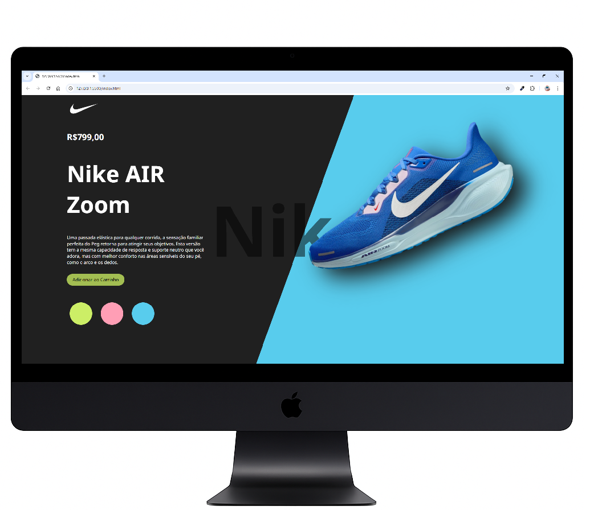

# 👟 Nike Product Page - Cover

Projeto de página web que simula uma página de compra da Nike, com transição dinâmica das imagens dos tênis e mudança de cores do fundo conforme o usuário clica nas bolinhas. Desenvolvido com HTML, CSS e JavaScript para oferecer uma experiência interativa e visualmente agradável.

---

## 🛠 Tecnologias utilizadas

- HTML  
- CSS  
- JavaScript  

---

---
## ✨ Funcionalidades

- Transição suave entre imagens dos tênis  
- Mudança de cor do fundo da página e do tênis conforme a seleção  
- Interface responsiva e interativa  

---

## 🚀 Como usar

1. Clone este repositório:  
```bash
git clone https://github.com/seuusuario/seuprojeto.git
